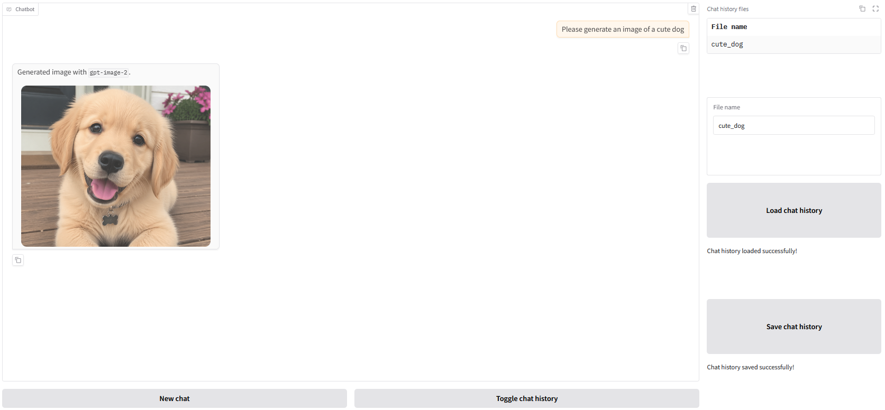
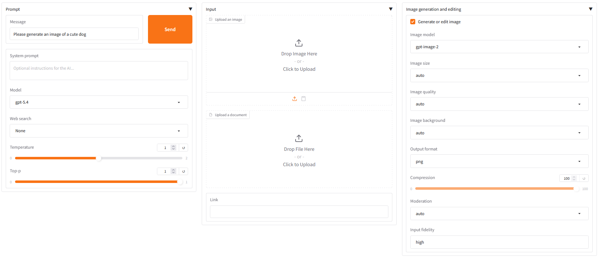

# ChatBot using OpenAI API with Gradio Web UI




## Features:
- Select different OpenAI models
- Image analysis
- Document analysis (PDF, MS Word, MS Excel, MS PowerPoint, text files)
- Image generation
- Save and load chat history

## Installation:
This app requires an OpenAI API key, register for one at [this website](https://openai.com/index/openai-api/).
- Clone this repo: Open terminal

```
git clone https://github.com/phatdatnguyen/openai-gradio-chatbot
```
- Create virtual environment:

```
cd openai-gradio-chatbot
python -m venv chatbot-env
chatbot-env\Scripts\activate
```
- Install the required packages:

```
pip install -r requirements.txt
```
- Store your API key in either `api_key.py` or the `OPENAI_API_KEY` environment variable.

Option 1: create a file named `api_key.py` and store your API key in the `API_KEY` variable:
```
API_KEY = "<your API key>"
```

Option 2: set an environment variable before starting the app:

```
set OPENAI_API_KEY=<your API key>
```
## Start web UI
To start the web UI:
- Run `start_webui.bat`
