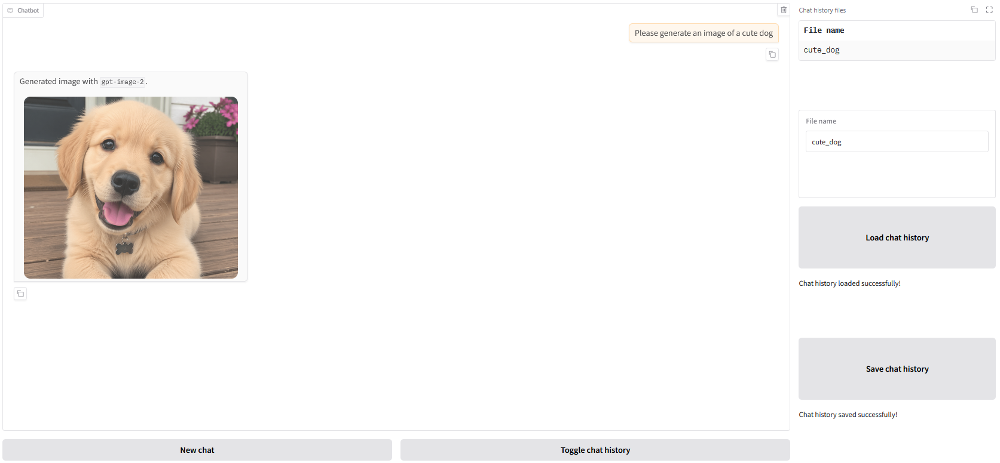
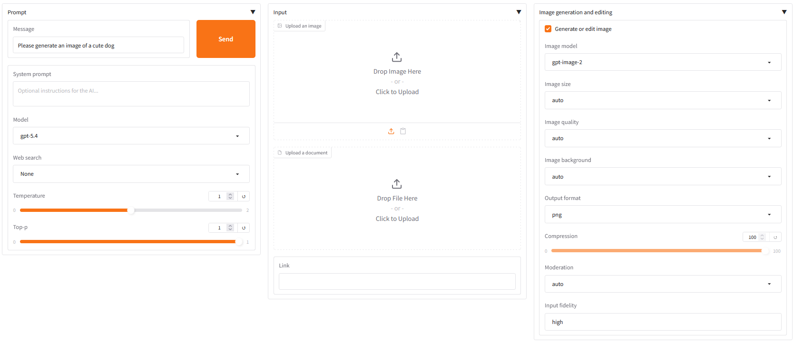

# ChatBot using OpenAI API with Gradio Web UI




## Features:
- Select different OpenAI models
- Streaming responses, with a Stop button; models without streaming return their full reply
- Model-specific reasoning effort controls for the o-series, GPT-5, and GPT-6 models
- Web search
- Image analysis
- Document analysis (PDF, MS Word, MS Excel, MS PowerPoint, HTML, text files)
- Image generation and editing
- Save, load and delete chat history

Failed requests keep the attempted prompt visible for copying and exclude it from
future requests. Saved chats use atomic JSON replacement, and image files stay under
`history/assets`. Loading a missing or damaged chat preserves the active conversation.

Image context usage is estimated from dimensions and documented model rules; models
without published sizing rules use a conservative fallback. Generated image bytes are
kept for display and saving, with a short placeholder sent in later text conversations.
Scanned PDFs need OCR before upload. Legacy `.xls` files are supported through `xlrd`.

## Installation:
This app requires an OpenAI API key, register for one at [this website](https://openai.com/index/openai-api/).
- Clone this repo: Open terminal

```
git clone https://github.com/phatdatnguyen/openai-gradio-chatbot
```
- Create virtual environment:

```
cd openai-gradio-chatbot
python -m venv chatbot-env
chatbot-env\Scripts\activate
```
- Install the required packages:

```
pip install -r requirements.txt
```
- Store your API key in either `api_key.py` or the `OPENAI_API_KEY` environment variable.

Option 1: create a file named `api_key.py` and store your API key in the `API_KEY` variable:
```
API_KEY = "<your API key>"
```

Option 2: set an environment variable before starting the app:

```
set OPENAI_API_KEY=<your API key>
```
## Start web UI
To start the web UI:
- Run `start_webui.bat`

## Running the tests
```
pip install -r requirements-dev.txt
pytest -q
```
