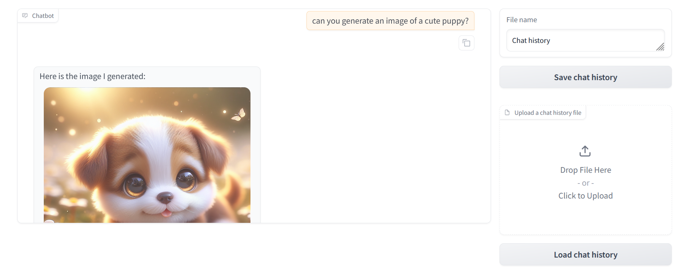
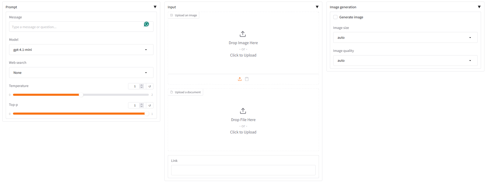

# ChatBot using OpenAI API with Gradio Web UI




## Features:
- Select different OpenAI models
- Image analysis
- Document analysis (PDF, MS Word, MS Excel, MS PowerPoint)
- Image generation
- Save and load chat history

## Installation:
This app requires OpenAI API key, register for one at [this website](https://openai.com/index/openai-api/).
- Clone this repo: Open terminal

```
git clone https://github.com/phatdatnguyen/openai-gradio-chatbot
```
- Install the required packages:

```
pip install -r requirements.txt
```
- Create a file name `api_key.py` and store your API key in `API_KEY` variable.
```
API_KEY = "<your API key>"
```
## Start web UI
To start the web UI:

```
python webui.py
```